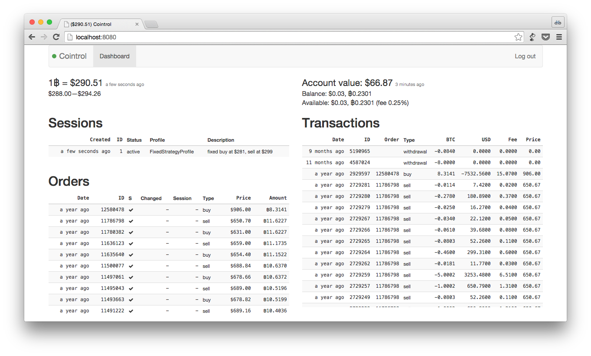
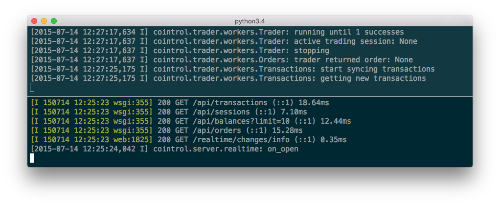
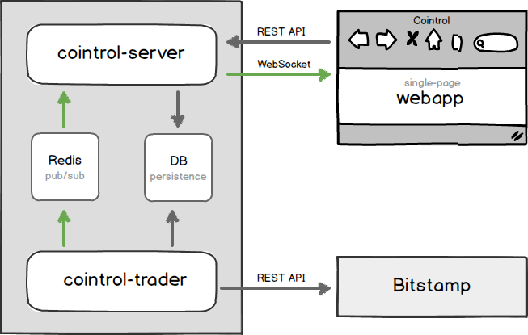
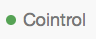
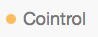
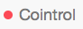

# Cointrol

Cointrol is a Bitcoin trading bot and real-time dashboard for [Bitstamp](https://bitstamp.net) created by [@jkbrzt](https://twitter.com/jkbrzt).






**Cointrol was created to automate Bitcoin speculation.** Besides automated trading based on price change triggers and various trading strategies, it also provides a **real-time updated dashboard for your Bitstamp account** where you can see all your orders and transactions real-time updated (something Bitstamp lacks). The dashboard  for a real-time updated overview can also be used standalone without letting Cointrol make any transactions.

Even though the original idea was to perhaps provide a fully-fledged hosted service, the system remained quite basic as it has only been used by its creator for a period of time in the winter of '13/'14 (when BTC price fluctuations were pretty insane). Some of the obvious limitations—all of which could easily be addressed—are:

* Only basic trading strategies are implemented
* Single user/Bitstamp account is supported
* Only one active trading session at a time
* The **whole account value is used** when trading
* Django admin is used for auth and trading strategy/session manipulations

Even though Cointrol has been used for real transactions, no guarantees are provided in terms of security, correctness, etc. (see `LICENCE`).


## Architecture

The system consists of the following components:




####`cointrol-trader`

* Polls various Bitstamp API endpoints
* Writes changes to DB
* Publishes changes to Redis pub/sub
* Opens orders, when suitable


###`cointrol-server`

* Serves Webapp static files
* Exposes DB for Webapp via a REST API
* Forwards Redis pub/sub messages from Trader to Webapp via WebSocket
* Exposes Django administration that is currently used for managing trading sessions


### `webapp`

* REST/WebSocket API-powered Single Page App
* Real-time updated overview on orders, transactions, and trading sessions


## Technology

**The server-side parts** (`cointrol-server` + `cointrol-trader`) are written in **Python 3** (3.3+ is required) and use a mixture of **Django** (models, admin) and **Tornado** (WebSockets, async IO). Other libraries that are used include sockjs-tornado, Django REST framework.

**The single-page webapp** is written in CoffeeScript, Sass, Handlebars and uses Backbone.js, Brunch, socksjs-client, Bootstrap.


## Installation


### 0. Prerequisites

Make sure you have the following software installed on your system:

* Python 3.3+
* Redis
* npm


### 1. Install Cointrol

#### 1.1 Install `cointrol-server` & `cointrol-trader`
```bash
mkdir Cointrol && cd Cointrol

# Create an isolated Python virtual environment
pip install virtualenv
virtualenv ./virtualenv --python=$(which python3)

# Activate the virtualenv
# IMPORTANT: it needs to be activated every time before you run
#            a manage.py or cointrol-* command.
. virtualenv/bin/activate

# Get the code
git clone git@github.com:jkbrzt/cointrol.git

# Create a local settings file
echo 'from .settings_dev import *' > cointrol/cointrol/conf/settings_local.py

# Install Python requirements
pip install -r cointrol/cointrol/conf/requirements.txt

# Initialize the database
cointrol/manage.py migrate

# Install cointrol-*
pip install -e ./cointrol

```

#### 1.2 Build the single-page app web client and install its dependencies


```bash
# Install dependencies
sudo npm -g install bower
cd cointrol/webapp
npm install
bower install

# Build the app
brunch build

# Use `brunch watch` during development
```

### 2. Create a Django user

```bash
. virtualenv/bin/activate
cointrol/manage.py createsuperuser
```


### 3. Configure Bitstamp API access

#### 3.1 Get API key and secret

Go to [https://www.bitstamp.net/account/security/api](https://www.bitstamp.net/account/security/api). Create a new key and configure permissions for it. Cointrol needs at least the following permissions:

 * `Account balance`
 * `User transactions`
 * `Open orders`
 
If you want Cointrol make transactions for you, select two following permissions as well:

  * `Buy limit order`
  * `Sell limit order`

Don't forget to activate the key by clicking "Activate" and confirming the email you receive from Bitstamp. 


#### 3.2 Configure Cointrol with the API credentials
1. Activate the virtualenv and run `cointrol-server`
2. Go to [http://localhost:8000/admin/core/account/1/](http://localhost:8000/admin/core/account/1/) and enter your Bitstamp username as well as the API key and secret to the form there.

## Usage


### Start `cointrol-server`


```bash
. virtualenv/bin/activate
cointrol-server
```


By default, it will run on [http://localhost:8000](http://localhost:8000). You can change the port with `--port=<port>`. 

Use this convenient link to log in: [http://localhost:8000/admin/login/?next=/](http://localhost:8000/admin/login/?next=/) — the Django admin interface is used for authentication, and this link ensures redirection back to the app after signing you in.

**Connection indicator colors explained:**



Green: The web app has a WebSocket connection to `cointrol-server`, and *have* recently heard from `cointrol-trader`. 




Amber: The web app has a WeSocket connection to `cointrol-server`, but 
*have not* heard from `cointrol-trader` in a while.



Red: The web app couldn't establish WebSocket connection to `cointrol-server`.


### Start `cointrol-trader`

```bash
. virtualenv/bin/activate
cointrol-trader
```

Note, until trading is configured  and the `COINTROL_DO_TRADE` settings set to `True` (covered in a later step), the trader won't make any transactions. It only pulls your data from Bitstamp to populate the dashboard view.

### Trading

Until the following steps are completed and trading is explicitly enabled, Cointrol doesn't attempt to make any transaction on your behalf:

1. Through the admin ([http://localhost:8000/admin/](http://localhost:8000/admin/)) you can create a trading strategy profile. It can be for the *fixed* (fixed price points in USD are used as buy/sell triggers) or the *relative* (percentage of the initial BTC price are used) strategy.
2. Create a trading session (also in the admin interface).
3. To perform actual transactions, you'll have to enable them in the settings (we used the `settings_dev` module which disables them). Add `COINTROL_DO_TRADE = True` to your `cointrol/cointrol/conf/settings_local.py`.


## Settings

The settings is resolved in this order: 

1. `settings_local.py`
2. `settings_(prod|dev).py` 
3. `settings_defaults.py`
4.  Django defaults

During the installation process, you've created `cointrol/cointrol/conf/settings_local.py` which imports settings from the `settings_dev.py` file. All the settings are [Django settings](https://docs.djangoproject.com/en/1.7/ref/settings/). The only non-Django settings is `COINTROL_DO_TRADE` (`False` in `dev`, `True` in `prod`). You can override any of the default settings in the `settings_local.py` file.

Besides `settings_dev.py`, the `conf` directory also has `settings_prod.py`, which is more suitable for production use. It defines logging configuration which makes messages of a level `>=` `WARNING` logged by the trader to be sent to you via email (e.g. when the trader places an order or there is an error). If you decide to use this settings file (by changing the import in `settings_local.py` to `from .settings_prod import *`, you'll have to configure at least [`DATABASES`](https://docs.djangoproject.com/en/1.7/ref/settings/#databases), [`ADMINS`](https://docs.djangoproject.com/en/1.7/ref/settings/#admins) and [`SECRET_KEY`](https://docs.djangoproject.com/en/1.7/ref/settings/#secret-key) as well in your in `settings_local.py`.


## Contact

Jakub Roztocil

* [https://github.com/jkbrzt](https://github.com/jkbrzt)
* [https://twitter.com/jkbrzt](https://twitter.com/jkbrzt)
* [http://roztocil.co](http://roztocil.co)
* `3NVcdcoXrBV7jKv7T3st6kQz7XdsPNUn34`

## Licence

MIT. See [LICENCE](./LICENCE).


